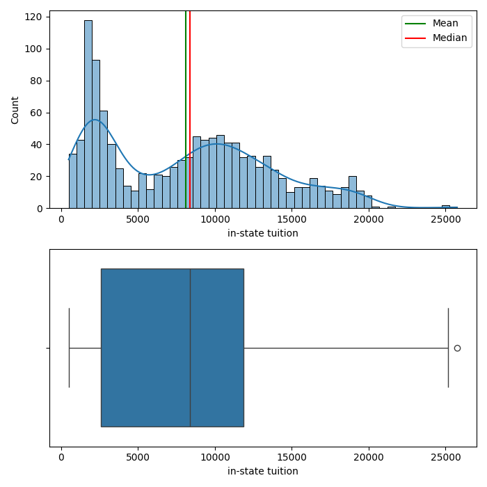
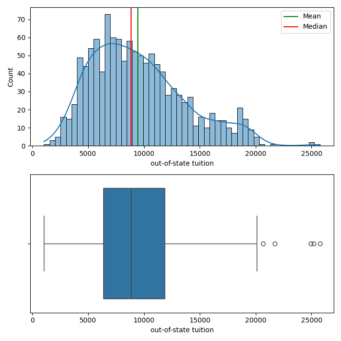

# Higher Education Consulting Analytics

## Problem Statement

- This dataset contains graduation rate information from many universities and colleges, as well as information like tuition, acceptance rates, top student rates, etc.

- Using the information provided in this dataset, I will attempt to predict the graduation rate of the universities and colleges.

## Data Dictionary

| Column Name              | Description                                     |
| ------------------------ | ----------------------------------------------- |
| College Name             | Name of the College                             |
| State                    | State college is in                             |
| Public(1)/Private(2)     | Whether the school is public (1) or private (2) |
| # appli. rec'd           | number of applications recieved                 |
| # appl. accepted         | number of applications accepted                 |
| # new stud. enrolled     | number of new students enrolled                 |
| % new stud. from top 10% | percent of new students from top 10%            |
| % new stud. from top 25% | percent of new students from top 25%            |
| # FT Undergrad           | number of Full time undergrad                   |
| # PT Undergrad           | number of Part time undergrad                   |
| in-state tuition         | in state tuition cost                           |
| out-of-state tuition     | out of state tuition cost                       |
| room                     | cost of room                                    |
| board                    | cost of board                                   |
| add. fees                | additional fees cost                            |
| estim. book costs        | estimated book costs                            |
| estim. personal $        | estimated personal costs                        |
| % fac. w/PHD             | percent of faculty with PHD                     |
| stud./fac. ratio         | student/faculty ratio                           |
| Graduation Rate          | Graduation Rate                                 |

## Executive Summary

### Data Cleaning Steps

For this dataset, I made the decision to keep the majority of the outliers, and high numbers for columns like applications recieved/accepted, or large tuitions, may indicate large schools, and it would be detrimental to the model to remove these outliers. I did remove outliers that are errors in data collection however.

I also dropped missing values from the target column, Graduation Rate, so as to not train the model on synthetic values.

Some columns did recieve imputation methods to fill in the numerous missing values, such as the in-state and out-of-state tuition. Since there were outliers, I calculated the imputation values of mean and median without the outliers consiered, to get a more accurate mean/median value. 

### Key Visualizations

Include key visualizations that highlight important aspects of the data. Use graphs, charts, or any other visual representation to make your points.

#### Visualization 1: [In-State Tuition Before and After Cleaning]

[Description and interpretation of the first visualization.]

##### Before Cleaning

##### After Cleaning

#### Visualization 2: [Out-of-State Tuiton Before and After Cleaning]

[Description and interpretation of the second visualization.]

##### Before Cleaning

##### After Cleaning

## Conclusions/Recommendations

I tested with numerous models, such as Linear Regression, Random Forest, and K Nearest Neighbors. 

The best performing model was Linear Regression when the test size was 0.3. 

The $R^2$ score was 0.46, which means the model could explain 46% of the variance of the graduation rate. 

The RMSE score was 13.1, which means on average, it can accurately predict the graduation rate within 13.1%

## Additional Information

Include any additional information, references, or resources that might be relevant for understanding the analysis.

---

Feel free to replace the placeholders with your actual content. Additionally, if you have images for your visualizations, make sure to replace the placeholder paths with the correct file paths or URLs.

Once you've filled in the content, save the file with a `.md` extension (e.g., `README.md`). You can use this Markdown file on platforms like GitHub to provide a well-structured README for your analysis.
